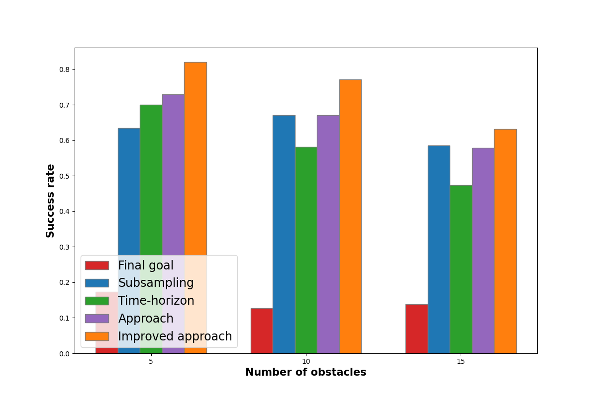
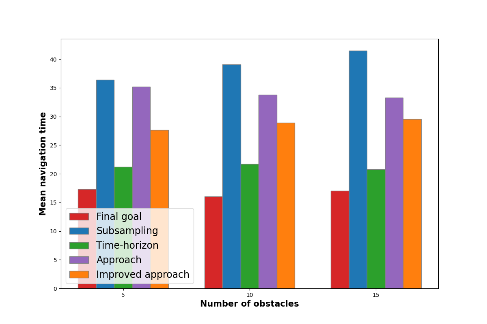

# Long range navigation in complex and dynamic environments with full-Stack S-DOVS

# [Paper]() || [Video]()

## Abstract
Robotic autonomous navigation in dynamic environments is a complex problem, as traditional planners may fail to take dynamic obstacles and their variables into account. The Strategy-based Dynamic Object Velocity Space (S-DOVS) planner has been proposed as a solution to navigate in such scenarios. However, it has limitations such as the inability to reach a goal in a large known map, avoid convex objects or handle trap situations. In this article, we present a modified version of the S-DOVS planner that is integrated into a full navigation stack, which includes a localization system, obstacle tracker, and waypoint generator. Our waypoint generator has been shown to outperform other approaches in terms of success rate and time to reach the goal when combined with the S-DOVS planner. The modified S-DOVS planner takes into account robot kinodynamic constraints and is capable of navigating through large scenarios with known map information. Extensive simulation and ground robot tests demonstrate the effectiveness of our system, even in the presence of dynamic obstacles and replanning requirements. Overall, our work represents a significant step forward in the development of robust and reliable autonomous navigation systems for real-world scenarios.

## Setup
1. Install ROS (tried with melodic, should work with noetic)
2. Install move base
3. Create ROS workspace
4. Download the package and build it with catkin_make or catkin build

## Getting Started
This repo contains a waypoint generator to conect a global planner to a motion planner of dynamic environments. The local planner could be, for example A* or RRT, and the motion planner may be stategies-based or DRL-based. 5 waypoint generators are implemented:
- The one used in Full-stack S-DOVS. ([Paper available here](https://link.springer.com/chapter/10.1007/978-3-031-21062-4_2)).
- Publishing the last goal.
- A subsampling.
- Providing the next waypoint within a spatial horizon.
- The improved version of the one used in Full-stack S-DOVS.
  
The waypoint generator to use may be chosen in the launch file.

## Comparison of the waypoint generators

## Citation

